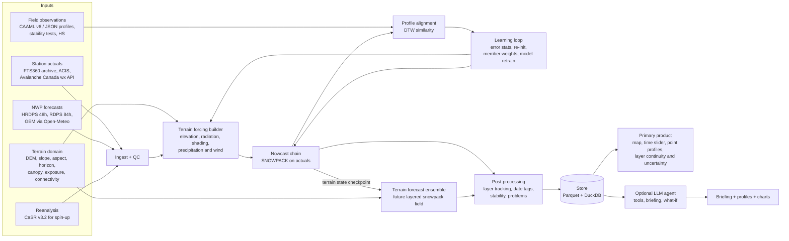

# Snowpack Structure Agent

> **Status (2026-09-30): first milestone implemented.** EXPERIMENTAL snowpack-structure predictions for expert
> decision support — not avalanche forecasts or operational guidance. The only inputs so far are SYNTHETIC.

## Quickstart

```bash
bash scripts/build_snowpack.sh                     # pinned SNOWPACK b324cbd -> /opt/snowpack (~5 min)
uv venv .venv -p 3.11 && uv pip install -p .venv/bin/python -e '.[dev]'
.venv/bin/snowagent doctor                          # deps + engine version + real smoke column
.venv/bin/snowagent demo --output artifacts/demo    # synthetic fixture -> replay -> 72 h, 5-member forecast (~2.5 min)
.venv/bin/snowagent predict --domain artifacts/demo/domain \
    --forecast artifacts/demo/inputs/weather/SYNTHETIC_forecast_20260115T00Z.csv --state latest_valid \
    --runs artifacts/demo/runs_again               # a run id is write-once; use a fresh runs dir to re-issue
.venv/bin/snowagent profile --run <run-id> --runs artifacts/demo/runs --lat 51.19657 --lon -115.69045 --lead-hours 24
.venv/bin/pytest -q                                 # unit + real-engine integration tests
```

Real-data path: `snowagent build-domain` (DEM + boundary + land cover) -> `snowagent init` (history,
explicit `--initial-condition snow_free`) -> `snowagent predict` -> `snowagent profile`.
Design decisions: `docs/decisions.md`; data needed next: `docs/data-intake-checklist.md`;
sample real-engine outputs from the synthetic demo: `artifacts/sample/`.

---

# Snowpack Structure Agent — Build Guide for Claude Code

A predictive system that takes a terrain domain and weather forecasts and produces a spatially varying, evolving snowpack: layer sequence, depths, grain forms, density, hardness, temperature, moisture, crusts and candidate weak layers. Historical weather maintains the starting snowpack; field observations train, calibrate and periodically correct the system. A new pit is not required to make a prediction.

Target region: Canadian Rockies (Banff, Yoho, Kootenay and adjacent ranges). The deliverable is a forecast snowpack field with queryable profiles, not a station-calibration tool or a text briefing.

> Revision 2, 30 September 2026: read `docs/terrain-forecast-product-spec.md` FIRST. It defines the product and supersedes station-only scope, fixed-slope production geometry, earlier phase ordering and any implication that observation ingestion is the end product. Read the research paper for evidence and `CLAUDE.md` for working rules. The configuration and numerical defaults below remain untested implementation sketches, not validated settings.

---

## 1. What this system is and is not

**Is**
- A terrain-conditioned forecast engine that predicts profiles in unobserved terrain units, not just at weather stations.
- A persistent snowpack state advanced with actual weather, then branched through forecast weather; SNOWPACK is the proposed initial vertical-process engine.
- An observation loop that compares predictions to field profiles, learns systematic errors, re-anchors the model, and tracks performance over time.
- An LLM agent layer that orchestrates runs, explains why layers formed, runs what-if scenarios and writes forecaster briefings with explicit uncertainty.

**Is not**
- A requirement to train an end-to-end neural network before predictions can be produced. A learned transition model or emulator is a later candidate, contingent on independent terrain and season validation.
- An avalanche forecast or danger rating. Output is advisory decision support; a qualified forecaster owns every decision.
- A claim that independent 1D columns resolve wind redistribution. The initial terrain-column product must mark transport as unresolved; the full target includes a separately validated, mass-conserving transport coupling.

---

## 2. Architecture



### 2.1 Core loop (triggered by a new usable forecast run; daily fallback)

1. Ingest new actuals and the latest NWP run.
2. QC and build terrain-conditioned forcing for each terrain unit, preserving source resolution and uncertainty.
3. Advance the **nowcast** from yesterday's state to now using actuals.
4. If a new field profile exists: align, score, log errors; if it passes quality gates and the re-init policy triggers, re-initialize that station.
5. Run the **forecast** ensemble from the terrain nowcast state for the available forecast horizon. No new pit is required.
6. Post-process: layers, date tags, stability indices, avalanche-problem metrics, ensemble percentiles.
7. Publish the versioned snowpack field, point profiles, layer-change diagnostics and uncertainty; an optional agent writes a briefing.
8. Weekly/seasonally: retrain learned components; champion/challenger evaluation.

---

## 3. Repository layout

```
snowpack-agent/
├── README.md                     # this file
├── CLAUDE.md                     # working rules for Claude Code
├── docs/
│   └── snowpack-structure-research-paper.md
├── config/
│   ├── sites.yaml                # virtual station definitions (user supplies)
│   ├── sources.yaml              # data source endpoints and credentials refs
│   ├── snowpack/base.ini         # SNOWPACK baseline config
│   └── pipeline.yaml             # thresholds, ensemble size, schedules
├── data/                         # gitignored
│   ├── raw/                      # untouched downloads, by source/date
│   ├── interim/                  # QC'd, unit-normalized
│   ├── forcing/                  # SMET per virtual station per run
│   ├── observations/             # profiles, tests, HS obs (normalized JSON)
│   ├── runs/                     # SNOWPACK outputs (.pro, .smet, .sno) by run_id
│   └── store/                    # Parquet + DuckDB
├── docker/
│   └── snowpack.Dockerfile
├── src/snowagent/
│   ├── ingest/                   # one module per source
│   ├── qc/
│   ├── forcing/                  # bias correction, phase, lapse, smet writer
│   ├── model/                    # SNOWPACK runner, restart handling, ensemble
│   ├── obs/                      # CAAML/JSON parsing, OGRS code mapping
│   ├── align/                    # DTW alignment + similarity (R bridge first)
│   ├── post/                     # layer tracking, stability, problems, DBA
│   ├── learn/                    # bias models, instability model, re-init policy
│   ├── verify/                   # metrics and reports
│   ├── store/                    # schema, read/write
│   ├── agent/                    # LLM tools, prompts, briefing templates
│   └── cli.py
├── r/                            # thin Rscript wrappers for sarp.snowprofile*
├── tests/
│   ├── fixtures/                 # tiny synthetic station + profile data
│   └── ...
└── templates/                    # input templates for the user
```

---

## 4. Technology choices

| Concern | Choice | Reason |
|---|---|---|
| Language | Python 3.11+ | Ecosystem; `snowpat` for SMET/PRO I/O |
| Snow model | SNOWPACK (latest release) in Docker | Canadian precedent; open source (LGPL-3.0) — [GitHub](https://github.com/snowpack-model/snowpack), [WSL GitLab](https://gitlabext.wsl.ch/snow-models/snowpack) |
| Model I/O | `snowpat` (SMET, PRO, iCSV) | [PyPI](https://pypi.org/project/snowpat/) |
| Profile alignment | R `sarp.snowprofile` + `sarp.snowprofile.alignment` via Rscript | Reference implementation of DTW similarity and DBA — [CRAN](https://cran.r-project.org/web/packages/sarp.snowprofile.alignment/vignettes/workflow.html) |
| Storage | Parquet + DuckDB (MVP); optional Postgres/PostGIS later | Local, versionable, zero-ops; aligns with the InfoEx analytics warehouse idea |
| ML | scikit-learn (RF, isotonic calibration), optionally LightGBM | Small tabular data; interpretable |
| Orchestration | Typer CLI + cron/systemd timer | Simple, auditable |
| Agent | Claude with tool calling; tools wrap the CLI/store | LLM never computes physics |
| Tests | pytest; golden-file tests for SMET/PRO | Reproducibility |

Pin versions in `pyproject.toml`, the Dockerfile and `renv.lock`. Record SNOWPACK version and config hash in every run's metadata.

---

## 5. Data contracts (what the user will provide)

All times in UTC ISO 8601 internally; convert on ingest. Units SI internally (K for temperature in SMET, m/s, W/m², mm or kg/m², m).

### 5.1 `config/sites.yaml`

```yaml
sites:
  - site_id: sunshine_village_tl        # stable id
    name: Sunshine Village treeline
    lat: 51.078
    lon: -115.782
    elevation_m: 2180
    elevation_band: TL                  # BTL | TL | ALP
    forecast_region: banff_yoho_kootenay
    station_ids: [fts360_sunshine]      # actuals feeding this site
    nwp_point: {lat: 51.078, lon: -115.782}
    slopes: [flat, N38, E38, S38, W38]  # virtual slopes to simulate
    soil: {ground_temp_K: 273.15, geothermal_W_m2: 0.06}
    sky_view: 0.9
    notes: sheltered study plot
```
(Coordinates above are placeholders; the user supplies real ones.)

### 5.2 Weather actuals (`templates/weather_actuals.csv`)

Hourly preferred; sub-hourly accepted and aggregated.

| column | unit | required | notes |
|---|---|---|---|
| station_id | — | yes | |
| timestamp_utc | ISO 8601 | yes | end of interval |
| ta_c | °C | yes | air temperature |
| rh_pct | % | yes | relative humidity (wrt water) |
| vw_ms | m/s | yes | mean wind |
| vw_max_ms | m/s | no | gust |
| dw_deg | ° | no | wind direction |
| iswr_wm2 | W/m² | no | incoming shortwave |
| rswr_wm2 | W/m² | no | reflected shortwave |
| ilwr_wm2 | W/m² | no | incoming longwave |
| tss_c | °C | no | snow surface temperature |
| tsg_c | °C | no | ground temperature |
| hs_cm | cm | strongly recommended | snow height |
| psum_mm | mm | recommended | precip in interval (heated/weighing gauge) |
| hn24_cm | cm | no | manual board |
| qc_flag | — | no | source QC if any |

Minimum viable set: TA, RH, VW, HS, and either PSUM or HS-derived precipitation. Radiation is parameterized if missing ([SNOWPACK data requirements](https://snowpack.slf.ch/doc-release/html/requirements.html)), but real radiation greatly improves surface hoar, facets and crusts.

### 5.3 Weather forecasts

Store every run, do not overwrite: `(source, model, run_init_utc, valid_utc, lead_h, lat, lon, variable, value)`. Variables: 2 m TA and RH (or dewpoint), 10 m and, for HRDPS, ~40 m wind, ISWR, ILWR, precipitation (and phase or freezing level if available), surface pressure.

### 5.4 Field snow profiles

Accept CAAML v6 IACS Snow Profile (XML or draft JSON — [CAAML](http://caaml.org/Schemas/SnowProfileIACS/)) and a flat JSON equivalent (`templates/profile.example.json`). Layers are recorded top-down with OGRS codes ([CAA OGRS 2024](https://cdn.ymaws.com/www.avalancheassociation.ca/resource/resmgr/standards_docs/ogrs2024web.pdf)):

```json
{
  "profile_id": "2026-01-14_sunshine_tl_01",
  "site_id": "sunshine_village_tl",
  "obs_time_utc": "2026-01-14T19:30:00Z",
  "observer": "initials-or-id",
  "lat": 51.078, "lon": -115.782, "elevation_m": 2180,
  "aspect_deg": 20, "slope_deg": 28,
  "hs_cm": 142,
  "air_temp_c": -12.5, "sky": "BKN", "precip": "Nil", "wind": "L-W",
  "layers": [
    {"top_cm": 142, "bottom_cm": 130, "grain_form": "PP", "grain_form_2": "DF",
     "grain_size_mm": [0.5, 1.0], "hardness": "F", "moisture": "D",
     "density_kg_m3": null, "date_tag": null, "comment": ""},
    {"top_cm": 88, "bottom_cm": 87, "grain_form": "SH", "grain_size_mm": [4, 6],
     "hardness": "F", "moisture": "D", "date_tag": "2026-01-05", "comment": "buried SH"}
  ],
  "temperatures": [{"depth_cm": 0, "t_c": -9.0}, {"depth_cm": 10, "t_c": -7.2}],
  "densities": [{"top_cm": 120, "bottom_cm": 110, "kg_m3": 180}],
  "tests": [
    {"type": "ECT", "result": "ECTP14", "depth_cm": 55, "fracture_character": "SC",
     "layer_date_tag": "2026-01-05"},
    {"type": "CT", "result": "CTM", "score": 17, "depth_cm": 55, "fracture_character": "SP"}
  ],
  "quality": "full"            
}
```
`quality`: `full` (eligible for re-init) | `test_profile` (layers above a test only) | `partial`.

Grain forms: PP, MM, DF, RG, FC, DH, SH, MF, IF with subclasses such as FCxr, MFcr ([Fierz et al., 2009](https://www.geobotany.org/library/pubs/FierzeC2009_snow_classif_UNESCO.pdf)). Keep `~` (not observed), `U` (unreliable) and `0` distinct, per OGRS.

### 5.5 Other observations (optional but valuable)

- Avalanche observations: time, location, size, trigger, aspect, elevation, failure layer date tag.
- Forecaster layer-of-concern list: date tag, grain form, elevation/aspect distribution, status by day.
- HN24/HST boards, HS stakes, SWE cores.

---

## 6. Data sources to implement

| Source | Use | Access notes |
|---|---|---|
| User's FTS360 archive | Primary actuals | User-provided export; treat as authoritative after QC |
| Avalanche Canada weather API | Additional mountain stations | `GET https://weather.prod.avalanche.ca/stations`, `/stations/{id}/measurements?fromDate=&toDate=` ([docs](https://avalanche.ca/api-docs)) |
| ACIS (Alberta) | Provincial/federal stations | [ACIS](https://acis.alberta.ca/acis/) — manual/export download |
| MSC GeoMet / Datamart | HRDPS, RDPS live forecasts | [MSC GeoMet](https://www.canada.ca/en/environment-climate-change/services/weather-general-tools-resources/weather-tools-specialized-data/msc-geomet-api-geospatial-web-services.html); [OGC API](https://api.weather.gc.ca/openapi). Archive every run locally — the live feed is not a long archive. |
| Open-Meteo GEM + Historical Forecast API | Convenience point forecasts; archived forecasts since ~2022 | [GEM API](https://open-meteo.com/en/docs/gem-api); [Historical Forecast](https://open-meteo.com/en/docs/historical-forecast-api). Model versions change; flag in metadata. |
| CaSR v3.2 | 1980–2024 reanalysis for spin-up/back-casting | [ECCC download](https://hpfx.collab.science.gc.ca/~scar700/rcas-casr/download.html); orographic biases persist ([HESS 2026](https://hess.copernicus.org/articles/30/5971/2026/)) |
| InfoEx | Profiles/observations the operation owns | Only data covered by existing agreements; no cross-operation pulls in MVP |

Every ingest module: idempotent, writes raw files unchanged, logs source URL + retrieval time + checksum.

---

## 7. Pipeline specification

### 7.1 QC (`qc/`)

Apply in order; never delete, only flag (`ok`, `suspect`, `bad`, `filled`):
- Physical range: TA −50…+35 °C; RH 5…100% (cap 100); VW 0…60 m/s; ISWR 0…1400 W/m²; ILWR 100…450 W/m²; HS 0…800 cm.
- Rate of change: TA > 10 °C/h, HS jumps > 30 cm/h without precipitation → suspect.
- Stuck sensor: identical values ≥ 6 h (except HS/ILWR under stable conditions — use variable-specific windows).
- Sensor icing / rime: wind = 0 with RH ≥ 95% and TA < 0 over many hours → suspect.
- HS noise: median filter then remove spikes; negative daily HS change is settlement, not negative snowfall.
- Radiation: ISWR at night → 0; RSWR > ISWR → suspect.
- Gap fill: linear ≤ 3 h; longer gaps from bias-corrected NWP with `filled` flag. Never hand-reconstruct data silently — SNOWPACK docs warn that manually reconstructed data can produce wrong results ([SNOWPACK data requirements](https://snowpack.slf.ch/doc-release/html/requirements.html)).

### 7.2 Forcing builder (`forcing/`)

1. **Elevation adjustment** of NWP to site elevation: temperature via local lapse rate estimated from station pairs (fallback −6.5 K/km), humidity via dewpoint conservation, precipitation via configurable factor (start 1.0; learned later).
2. **Bias correction** per `(site, variable, lead_time_bucket, month)`: start with additive (TA) / multiplicative (PSUM, ISWR) mean correction; upgrade to quantile mapping once ≥ 1 season of paired data exists. Fit only on training seasons.
3. **Precipitation phase**: compute wet-bulb temperature from TA, RH, pressure; liquid fraction as a logistic function of Tw with ~50% near Tw ≈ 1 °C following [Wang et al. (2019)](https://repository.library.noaa.gov/view/noaa/54993/noaa_54993_DS1.pdf). Verify coefficients against the paper, then calibrate the midpoint locally (Ram Mountain, Alberta found a 2.6 °C air-temperature threshold best — [Crémel et al., 2026](https://www.tandfonline.com/doi/full/10.1080/15230430.2026.2627695)). Write as `PSUM_PH` (0 solid … 1 liquid) in SMET.
4. **Precipitation scaling from HS**: rolling factor \(k = \Delta HS_{obs} / \Delta HS_{mod}\) over storm windows (not daily), clipped to 0.5–2.0; apply when |k − 1| > 0.10 (mirrors Avalanche Canada practice — [Krawetz, 2024](https://summit.sfu.ca/_flysystem/fedora/2025-02/etd23586.pdf); [Horton & Haegeli, 2022](https://tc.copernicus.org/articles/16/3393/2022/tc-16-3393-2022.pdf)).
5. **Wind height**: record measurement height; for HRDPS consider ~40 m winds for sheltered sites ([Horton et al., 2015](https://tc.copernicus.org/articles/9/1523/2015/tc-9-1523-2015.pdf)).
6. **Write SMET** per virtual station per run, hourly, with fields `TA RH VW DW ISWR ILWR PSUM PSUM_PH HS TSG` as available.

### 7.3 SNOWPACK runner (`model/`)

- Build `docker/snowpack.Dockerfile` from the official release package or source ([UiT example](https://research-software.uit.no/blog/2023-building-snowpack/)). Smoke test with the bundled example station before anything else.
- One run directory per `run_id = {chain}_{site}_{init_utc}_{member}`; store the exact `.ini`, `.sno`, `.smet` and outputs.
- **Nowcast**: continuous from season start (1 Sep–1 Oct, no snow) or last re-init; write restart `.sno` daily.
- **Forecast**: copy the latest nowcast `.sno`, run forecast forcing; never write back into the nowcast state.
- **Virtual slopes**: flat + N/E/S/W at 38°.
- **Ensemble** (Phase 5): perturb PSUM (multiplicative, lognormal σ ≈ 0.3), TA (±1–2 K), ISWR (±20%), ILWR (±15 W/m²), with temporal autocorrelation; 20 members to start. Ranges are inside those used by [Richter et al. (2020)](https://nhess.copernicus.org/preprints/nhess-2019-433/nhess-2019-433.pdf).

`config/snowpack/base.ini` starting point (key names must be verified against the installed version's documentation — [SNOWPACK docs](https://snowpack.slf.ch/doc-release/html/requirements.html), [advanced setups](https://snowpack.slf.ch/doc-dev/html/advanced_setups.html)):

```ini
[General]
BUFFER_SIZE = 370
BUFF_BEFORE = 1.5

[Input]
METEO = SMET
METEOPATH = ./input
SNOW = SMET
SNOWPATH = ./input
TIME_ZONE = 0

[Output]
METEOPATH = ./output
EXPERIMENT = run
PROF_WRITE = TRUE
PROF_FORMAT = PRO
PROF_START = 0.0
PROF_DAYS_BETWEEN = 0.125     ; 3-hourly profiles
TS_WRITE = TRUE
TS_DAYS_BETWEEN = 0.041666    ; hourly time series
SNOW_WRITE = TRUE             ; restart files
BACKUP_DAYS_BETWEEN = 1

[Snowpack]
CALCULATION_STEP_LENGTH = 15
ROUGHNESS_LENGTH = 0.002
HEIGHT_OF_METEO_VALUES = 2.0
HEIGHT_OF_WIND_VALUE = 10.0
ENFORCE_MEASURED_SNOW_HEIGHTS = FALSE   ; TRUE only for the diagnostic reference run
SW_MODE = INCOMING
ATMOSPHERIC_STABILITY = MO_MICHLMAYR
CANOPY = FALSE
MEAS_TSS = FALSE
CHANGE_BC = FALSE
SNP_SOIL = FALSE

[SnowpackAdvanced]
VARIANT = DEFAULT
NUMBER_SLOPES = 5
SNOW_REDISTRIBUTION = TRUE    ; windward erosion / leeward deposition on virtual slopes
HN_DENSITY = PARAMETERIZED
THRESH_RAIN = 1.2             ; used only if PSUM_PH absent
WATERTRANSPORTMODEL_SNOW = BUCKET
COMBINE_ELEMENTS = FALSE      ; keep thin layers (SH, crusts); SFU chain disabled aggregation
```

### 7.4 Observation handling (`obs/`)

- Parse CAAML v6 and JSON into one internal `Profile` model (pydantic). Map OGRS codes to SNOWPACK grain codes and to the `sarp.snowprofile` grain classes.
- Density gaps: estimate from grain form + hardness (Monti et al. 2014; crust 520 kg/m³, ice 910 kg/m³ — [Binder & Mitterer, 2023](https://arc.lib.montana.edu/snow-science/objects/ISSW2023_O4.02.pdf)); mark as estimated.
- Quality gate for re-init eligibility: full-depth; HS within ±20% of nearest HS sensor; monotonic layer boundaries; ≥ 3 temperatures; plausible hardness/grain combinations; observer-marked `full`.

### 7.5 Alignment and similarity (`align/`)

- Phase 1: shell out to R (`r/align.R`) using `sarp.snowprofile.alignment`. Inputs/outputs as JSON.
- Default settings from the research: resample 0.5 cm, Sakoe–Chiba window 0.3 (0.6 for model-vs-obs with height rescaling), symmetric P = 1, open end, hardness:grain weight 1:4, weak-layer/crust up-weighting, date-tag term enabled ([Herla, 2023](https://summit.sfu.ca/_flysystem/fedora/2024-01/etd22760.pdf); [Binder et al., 2024](https://arc.lib.montana.edu/snow-science/objects/ISSW2024_O3.10.pdf)).
- Output: overall similarity Φ; per-class scores (new snow, weak layers, crusts, bulk); layer match table (obs layer ↔ sim layer, depth offset, date offset, property differences).
- Optional Phase 6: port to Python with golden tests against R results.

### 7.6 Post-processing (`post/`)

- **Layer tracking and date tags**: tag simulated weak layers by burial date and crusts by formation date; group into regional date tags; match forecaster date tags within ±3 days ([Herla et al., 2024](https://nhess.copernicus.org/articles/24/2727/2024/)).
- **Stability**: read SK38, RTA, critical crack length from SNOWPACK output; compute p_unstable with the Mayer et al. (2022) six-feature random forest ([paper](https://www.dora.lib4ri.ch/wsl/dload/wsl:32201/PDF/Mayer-2022-A_random_forest_model_to-(published_version).pdf)) — re-implement from the published feature definitions, or use the AWSOME `qmah`/`snowpacktools` implementation if licensing permits ([AWSOME](https://arc.lib.montana.edu/snow-science/objects/ISSW2024_P1.33.pdf)). Thresholds: p_unstable ≥ 0.77, RTA ≥ 0.8, SK38 ≤ 1, r_c ≤ 0.3–0.4 m.
- **Avalanche-problem metrics** following Reuter et al. (2022): slab > 0.18 m and > 100 kg/m³; new snow ≥ 0.05 m/24 h; wet snow LWC ≥ 1% vol ([Reuter et al., 2022](https://www.dora.lib4ri.ch/wsl/islandora/object/wsl:29301/datastream/PDF2/Reuter-2022-Characterizing_snow_instability_with_avalanche-(accepted_version).pdf)); LWC index ≥ 1 ([J. Glaciology](https://www.cambridge.org/core/journals/journal-of-glaciology/article/automated-prediction-of-wetsnow-avalanche-activity-in-the-swiss-alps/166D6321D57FFAC04DC7CEE773C0A45A)).
- **Aggregation**: DBA representative profile per elevation band/region ([Herla et al., 2022](https://tc.copernicus.org/articles/16/3149/2022/)); ensemble 10/50/90th percentiles of depth-to-critical-layer and p_unstable ([Hatvan et al., 2024](https://arc.lib.montana.edu/snow-science/objects/ISSW2024_P7.11.pdf)).
- **Process attribution** (feeds the agent): for each tracked layer, store the weather window that formed it — e.g. surface hoar nights (clear, RH 70–90%, wind < 1.5 m/s, TSS −20 to −10 °C — [Horton et al., 2015](https://tc.copernicus.org/articles/9/1523/2015/tc-9-1523-2015.pdf)), facet periods (modelled near-surface gradient > 10 °C/m), rain-on-snow hours, solar crust days.

### 7.7 Learning loop (`learn/`)

Learned components, in priority order. Each is versioned, trained leave-one-season-out, and must beat the incumbent on held-out seasons before promotion.

| # | Component | Inputs → target | Method |
|---|---|---|---|
| L1 | Forcing bias correction | NWP by lead time → station actuals | Mean → quantile mapping |
| L2 | Precipitation factor | Storm-window ΔHS obs vs model → k | Rolling, clipped, per site |
| L3 | Phase threshold | Precip events with known phase (HS response, observer) → Tw midpoint | 1-parameter fit |
| L4 | Instability calibration | Sim layer features ↔ local test results (ECT/CT/PST + fracture character) | Recalibrate Mayer RF (isotonic) → retrain when ≥ ~150 matched layers |
| L5 | Layer existence/persistence | Tracked sim layer + weather since burial → still reported by obs / forecasters? | Gradient boosting / logistic |
| L6 | Property correction | Aligned obs–sim layer pairs → grain class/hardness/size correction | Ordinal/multiclass model, only if L1–L5 plateau |

Matching sim layers to observations for L4 follows Mayer et al.: HS within 20 cm, slab thickness within 20 cm, hardness within one step, both persistent or both non-persistent grain types.

**Re-initialization policy**: re-init a site from an observed profile when (a) the profile passes the quality gate, (b) Φ between current nowcast and profile < 0.5 or a critical layer is missing/extra, and (c) ≥ 10 days since last re-init. Keep a parallel non-reinitialized "free run" for verification ([Binder et al., 2024](https://arc.lib.montana.edu/snow-science/objects/ISSW2024_O3.10.pdf); [Ehrnsperger et al., 2024](https://arc.lib.montana.edu/snow-science/objects/ISSW2024_P3.14.pdf)).

**Ensemble weighting** (Phase 5): after each new profile, weight members by exp(−(1−Φ)²/2σ²) and HS error; resample if effective sample size < 50% (particle-filter logic from [Cluzet et al., 2021](https://gmd.copernicus.org/articles/14/1595/2021/)).

### 7.8 Verification (`verify/`)

Produce a season report and a rolling 30-day dashboard table:
- Forcing: bias/RMSE by variable, lead time, site.
- Bulk: HS RMSE, bias; HN24/HN72 errors; daily ΔHS correlation.
- Profile: Φ (overall and by class) for nowcast, forecast, free run.
- Critical layers: POD, precision, false-alarm rate, PSS by layer type, with ±3-day date-tag matching.
- Stability: reliability diagrams and ROC for p_unstable vs field results.
- Always compare against the **uncorrected baseline** (raw NWP + default SNOWPACK).

Reference skill (paper §5): POD ≈ 75%, precision ≈ 40% for critical layers; Φ ≈ 0.5–0.6 for model-vs-pit.

### 7.9 Agent layer (`agent/`)

The agent calls tools; tools call the CLI and the store. Tools:

| Tool | Purpose |
|---|---|
| `get_site_status(site_id, date)` | Latest nowcast profile summary, tracked layers, data-quality flags |
| `get_forecast(site_id, init)` | Ensemble percentiles of new snow, critical-layer depth, p_unstable |
| `explain_layer(site_id, date_tag)` | Weather window and process that formed it, current properties, trend |
| `compare_observation(profile_id)` | Alignment result, per-class similarity, discrepancies |
| `run_scenario(site_id, perturbation)` | What-if run (e.g. PSUM × 1.3, TA +2 K) returned as diff |
| `data_quality_report(window)` | Missing/suspect data and its impact |
| `verification_summary(window)` | Skill vs baseline |
| `propose_update(component)` | Drafts a retrain/re-init proposal for human approval |

Briefing format (Markdown + JSON): per site/elevation band — structure summary (top-down), tracked layers with date tag, depth range, grain, trend and p_unstable percentiles; what changed since yesterday and why; confidence and main uncertainties (precip, wind, data gaps); disagreements with latest field observations; limitations statement.

Hard rules for the agent: never state a layer exists unless it is in model output or an observation; always cite the run_id / profile_id; express uncertainty with ensemble percentiles; label outputs "advisory — not a forecast".

---

## 8. Store schema (DuckDB tables, Parquet-backed)

- `stations(station_id, source, lat, lon, elev_m, meta_json)`
- `wx_obs(station_id, ts_utc, var, value, unit, qc_flag, source_file)`
- `nwp(source, model, init_utc, valid_utc, lead_h, lat, lon, var, value)`
- `forcing(run_id, site_id, slope, ts_utc, var, value, provenance)`
- `runs(run_id, chain, site_id, init_utc, member, snowpack_version, config_hash, forcing_hash, status, created_at)`
- `sim_layers(run_id, slope, valid_utc, layer_idx, top_cm, bottom_cm, grain_code, grain_class, gs_mm, hardness, density, temp_c, lwc, deposition_utc, sk38, rta, rc_m, p_unstable)`
- `tracked_layers(site_id, date_tag, layer_type, first_seen_utc, status, notes)`
- `obs_profiles(profile_id, site_id, obs_utc, observer, quality, raw_path)` + `obs_layers`, `obs_tests`
- `alignments(profile_id, run_id, phi, phi_newsnow, phi_wl, phi_crust, phi_bulk, match_json)`
- `models(component, version, trained_on, metrics_json, status)` — champion/challenger
- `briefings(briefing_id, site_id, valid_utc, run_ids, text_md, json)`

---

## 9. Build phases and acceptance criteria

Work strictly in order. This revised sequence prioritizes producing terrain-dependent forecast profiles before advanced learning or an LLM interface; detailed contracts and tests are in `docs/terrain-forecast-product-spec.md`.

| Phase | Deliverable | Acceptance |
|---|---|---|
| 0 Scaffold | Repo, pyproject, Docker SNOWPACK, R env, CI, fixtures | `snowagent doctor` passes; SNOWPACK example station runs in container; tests green |
| 1 Terrain + inputs | DEM/land-cover ingest, terrain units, station and forecast QC | Correct CRS, slopes, aspects, horizons and source elevation; explicit missing-data handling |
| 2 Forecast product slice | Persistent terrain states; terrain-conditioned forcing; forecast profiles | A domain and archived forecast produce distinct future profiles at unobserved units without a new pit; no future-weather leakage |
| 3 Output + uncertainty | Layer tracking, map-ready field, profile queries, ensemble scenarios | Maps and profiles agree; forecast branches do not mutate nowcast; unresolved processes visible |
| 4 Observation evaluation | Profile parsing, alignment, structural scores and independent spatial tests | Native-depth and aligned errors reported; leave-season and leave-location-out results |
| 5 Terrain transport | Validated wind downscaling and conservative erosion/deposition adapter | Transport budget closes including domain boundaries and sublimation; no double counting of snowfall |
| 6 Learning loop | Terrain/forcing corrections, observation updates, optional transition emulator | Improvement on held-out terrain and seasons without degraded rare-layer detection; rollback retained |
| 7 Optional agent | Tools, briefing, scenarios | All statements traceable to run_id/profile_id; structured profiles remain primary output |
| 8 Operations | Forecast-triggered scheduler, stale-data alerts, backups | 14 consecutive unattended days; no-pit intervals still produce appropriately qualified forecasts |

---

## 10. CLI (target)

```
snowagent doctor
snowagent ingest actuals --source fts360 --path data/raw/fts360/
snowagent ingest nwp --model hrdps --init latest
snowagent ingest profiles --path data/raw/profiles/
snowagent forcing build --site all --chain nowcast
snowagent run nowcast --site all --until now
snowagent run forecast --site all --members 20
snowagent align --profile 2026-01-14_sunshine_tl_01
snowagent post --run latest
snowagent verify --season 2025-26 --report
snowagent learn fit --component bias --holdout season
snowagent reinit --site sunshine_village_tl --profile <id> --dry-run
snowagent brief --date today
snowagent backcast --season 2019-20 --forcing casr   # historical training data
```

---

## 11. Using historical data (what to do when the user delivers it)

1. Load `sites.yaml`; validate coordinates/elevations against a DEM.
2. Ingest all seasons of actuals; run QC; produce a data-coverage heat map per station/variable/season. Report gaps before modelling.
3. Back-cast each season: nowcast from actuals (free run) — this is the core training data linking weather to simulated structure.
4. Ingest all historical profiles and tests; align each against the same-day free run; build the error database.
5. Where historical forecasts exist (Open-Meteo archive from ~2022, or the user's own archive), pair them with actuals for L1.
6. Split by season: e.g. oldest seasons train, one validation season, most recent season test. Never random-split within a season.
7. Produce the baseline verification report before training any learned component.

---

## 12. Known pitfalls

- Precipitation dominates error — fix forcing before tuning physics.
- NWP under-predicts many Rockies storms; HRDPS HS was too low in much of the Rockies ([Horton & Haegeli, 2022](https://tc.copernicus.org/articles/16/3393/2022/tc-16-3393-2022.pdf)).
- Models over-produce facets (precision 20–40%) — treat as candidates, calibrate with tests ([Herla et al., 2024](https://nhess.copernicus.org/articles/24/2727/2024/)).
- SNOWPACK drops secondary grain form and observed hardness on profile import; large new-snow grain size can cause spurious surface depth hoar ([Ehrnsperger et al., 2024](https://arc.lib.montana.edu/snow-science/objects/ISSW2024_P3.14.pdf)).
- Layer aggregation merges thin critical layers — keep it off.
- Open-Meteo historical forecasts change model versions over time — store model version and do not treat as homogeneous.
- Pits are on sheltered, safe sites; do not over-fit to a single pit. Weight observations by quality and representativeness.
- Wind slabs: report as "not modelled spatially"; virtual-slope drift is indicative only.

---

## 13. Key references

Full synthesis with citations: `docs/snowpack-structure-research-paper.md`. Most-used:
- [Herla et al., 2024 — large-scale validation, critical layers (NHESS)](https://nhess.copernicus.org/articles/24/2727/2024/)
- [Herla et al., 2025 — quantitative module of avalanche hazard (NHESS)](https://nhess.copernicus.org/articles/25/625/2025/)
- [Horton, Herla & Haegeli, 2025 — clustering simulated profiles (GMD)](https://gmd.copernicus.org/articles/18/193/2025/)
- [Avalanche Canada snowpack model dashboard (Avalanche Journal)](https://avalanchejournal.ca/inside-the-snowpack-model-dashboard/)
- [Mayer et al., 2022 — random forest instability model (TC)](https://www.dora.lib4ri.ch/wsl/dload/wsl:32201/PDF/Mayer-2022-A_random_forest_model_to-(published_version).pdf)
- [Binder et al., 2024 — initializing with observed profiles (ISSW)](https://arc.lib.montana.edu/snow-science/objects/ISSW2024_O3.10.pdf)
- [Herla et al., 2021 — profile alignment with DTW (GMD preprint)](https://gmd.copernicus.org/preprints/gmd-2020-171/gmd-2020-171.pdf)
- [SNOWPACK data requirements](https://snowpack.slf.ch/doc-release/html/requirements.html)
- [CAA OGRS 2024](https://cdn.ymaws.com/www.avalancheassociation.ca/resource/resmgr/standards_docs/ogrs2024web.pdf)
- [CAAML v6 IACS Snow Profile](http://caaml.org/Schemas/SnowProfileIACS/)
