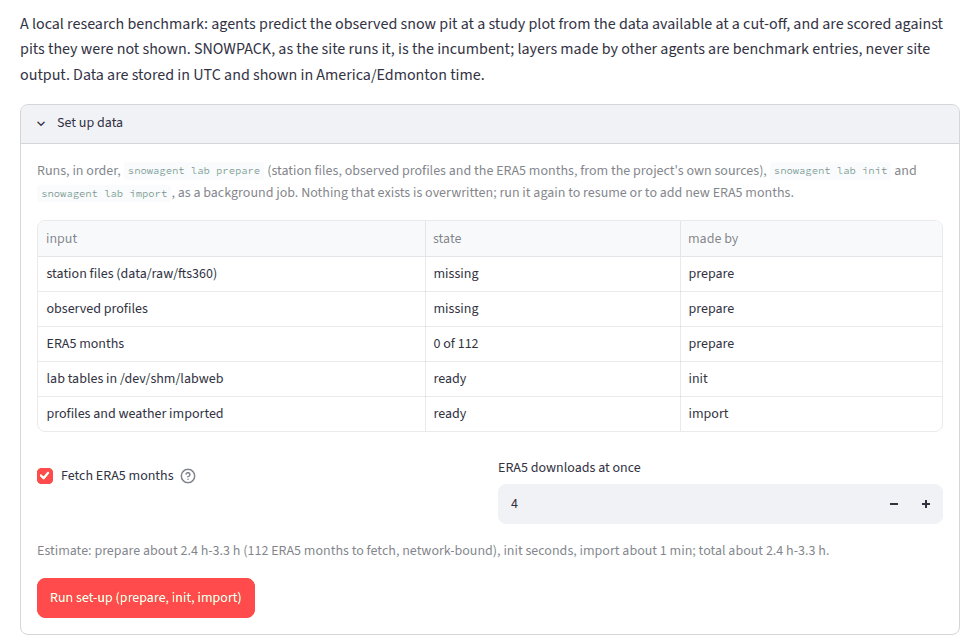
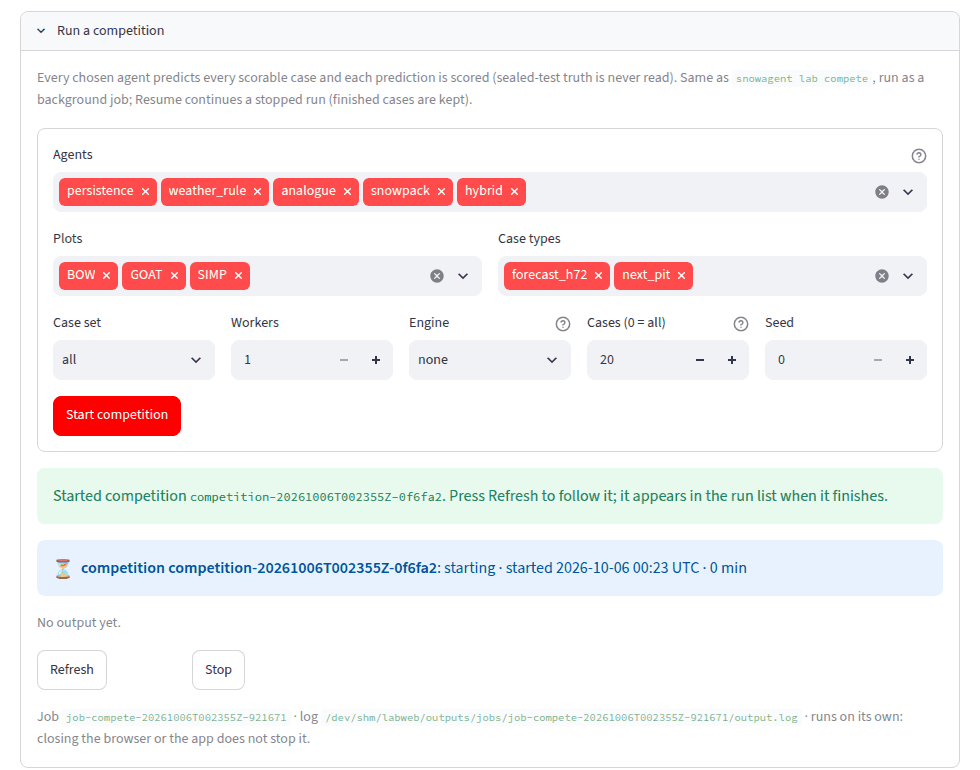
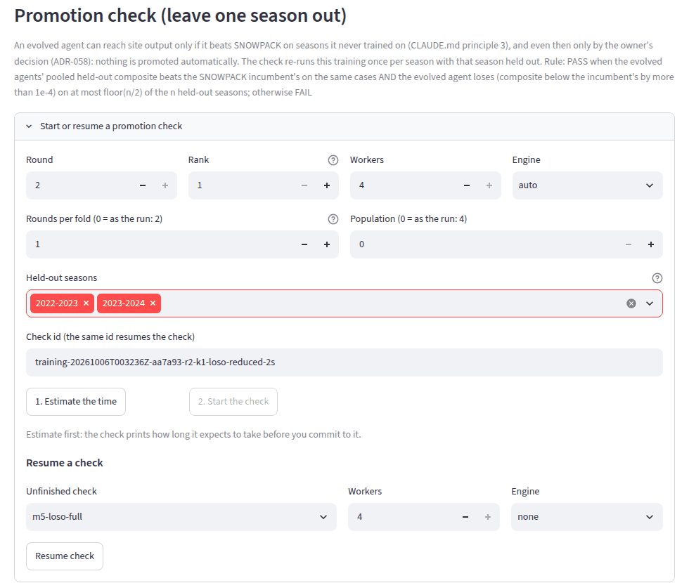
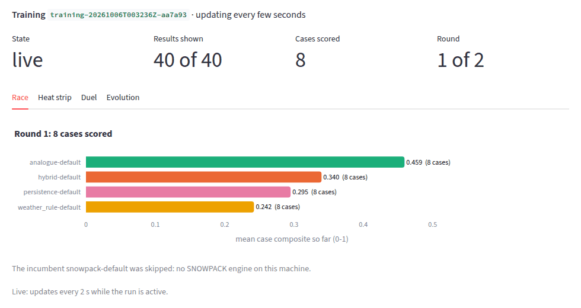
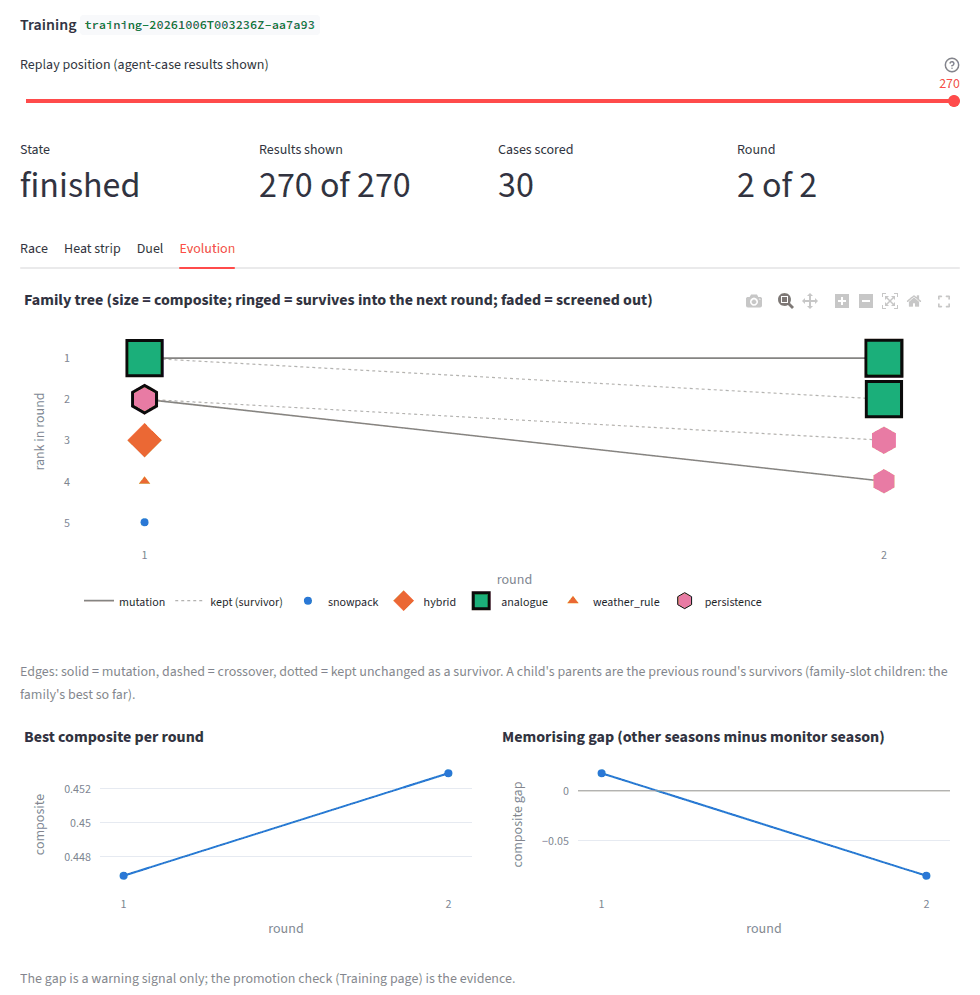
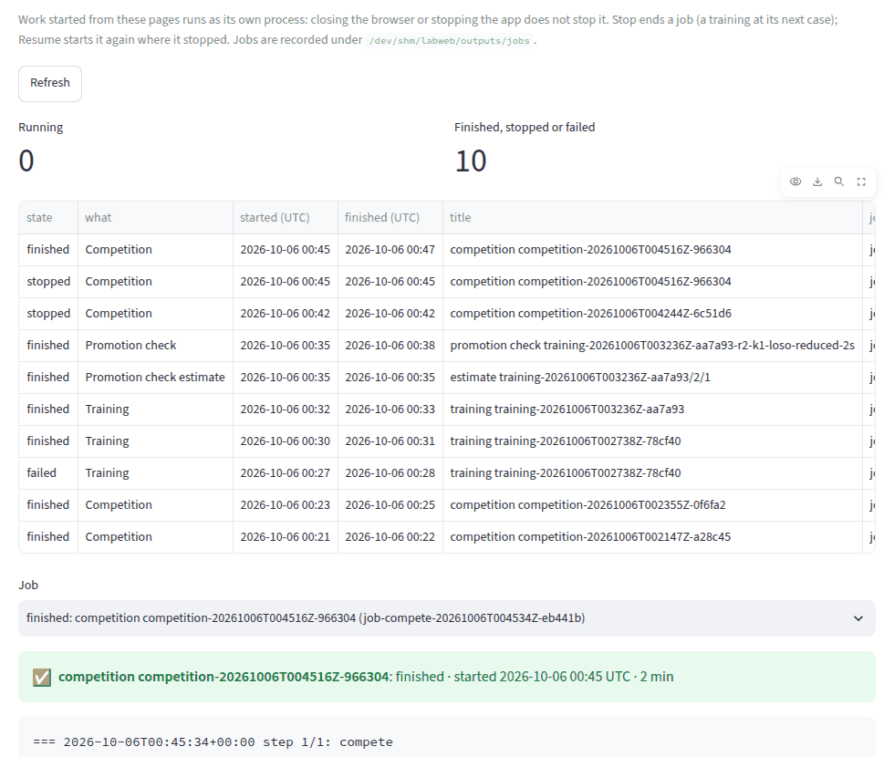

# Using the Snowpack Agent Lab in your web browser

**Research and decision support only. Nothing in the lab is an avalanche forecast or a danger rating**, and every
page says so. The lab is a local benchmark: computer "agents" try to predict the snow pit observed at Bow Summit,
Goat's Eye and Simpson from the data available beforehand, and are scored against pits they were not shown.
SNOWPACK, as the site runs it, is the agent to beat (the "incumbent").

This guide is for running the whole lab from a web browser on your Mac: setting up the data, running competitions,
training agents overnight, watching them in the Arena, and checking whether a trained agent really does better.
You type one command in Terminal to start the app; everything else is buttons in the browser. Long jobs keep
running on their own when you close the browser.

Contents

1. [First-time setup](#1-first-time-setup)
2. [Starting the app](#2-starting-the-app)
3. [A tour of the pages](#3-a-tour-of-the-pages)
4. [Running the lab from the browser, step by step](#4-running-the-lab-from-the-browser-step-by-step)
5. [The Arena: watching competitions and training](#5-the-arena-watching-competitions-and-training)
6. [Reading the results](#6-reading-the-results)
7. [Stopping and resuming](#7-stopping-and-resuming)
8. [Keeping the Mac awake overnight](#8-keeping-the-mac-awake-overnight)
9. [Where results are stored](#9-where-results-are-stored)
10. [Viewing from another device](#10-viewing-from-another-device)
11. [Troubleshooting](#11-troubleshooting)

## 1. First-time setup

You do this once. The installation needs Terminal; after it you will not need Terminal except to start the app.

1. Install the tools: follow [`run_locally.md`, section 0](run_locally.md#0-one-time-tools-about-10-minutes-mostly-downloads).
   A new Mac has no Homebrew (`zsh: command not found: brew`), so that section installs Homebrew first, puts it on
   your PATH and checks it with `brew --version` before `brew install python@3.12 cmake`. Do not skip it.
2. Follow steps 1 to 3 of [`run_locally.md`](run_locally.md#the-commands): clone the project, create the Python
   environment and the SNOWPACK engine (`bash scripts/setup_env.sh` does both).
3. That is all. Steps 4 to 9 of `run_locally.md` (prepare the data, build cases, train, check) can now be done from
   the browser, as below.

## 2. Starting the app

Open Terminal and type:

```bash
cd banff-snowpack                 # the folder you cloned
source .venv/bin/activate         # every time you open a new Terminal window
snowagent lab app
```

It prints the address and opens it in your browser:

```
Snowpack Agent Lab: http://localhost:8501  [Research and decision-support product only. ...]
data: /Users/you/banff-snowpack/data/lab
Ctrl-C stops the app; background jobs keep running (see the Jobs page).
```

If the browser does not open by itself, open **http://localhost:8501**. Leave the Terminal window open while you
use the app. To stop the app, click in that Terminal window and press **Ctrl-C**. Stopping the app does not stop
work you started from it (see [Stopping and resuming](#7-stopping-and-resuming)).

Options, if you need them: `--port 8502` (another port, for example if 8501 is in use), `--data-root <folder>`
(another lab data folder), `--no-open` (do not open the browser), `--host 0.0.0.0` (see
[Viewing from another device](#10-viewing-from-another-device)). The app works from any folder, but the
`source .venv/bin/activate` line must have been run in that Terminal window.

## 3. A tour of the pages

The page menu is in the left sidebar, grouped by what each page is for. Every page shows the research and
decision-support label at the top and in the sidebar.

| Menu group › page | What it is for | What to look at |
|---|---|---|
| Lab › **Overview** | The first page: what is ready, what is running, the best agent so far | Four ticks (pits, weather, SNOWPACK engine, benchmark cases), the running training with its finish time, the best agent; **Set up data** (first use); data coverage per site folded underneath |
| Evolve agents › **Training** | Start, stop, resume and follow training runs; the promotion check | The run panel at the top (state, round, best score, time left, Stop or Resume; it updates itself); best score per round and the memorising gap; the per-round leaderboard; the **Agent card**; **Promotion check** |
| Evolve agents › **Arena** | Watching runs as they happen, replays | The race, the heat strip, the duel and (training) the family tree |
| Results › **Leaderboard and pits** | Competitions: every agent on every case | **Run a competition**; the leaderboard table; a case's predicted profile beside the observed pit |
| Results › **Reports** | A plain-language report of a training run, to read or download | **Write the report**, then **Download (HTML)** (opens in a browser or Word; print it to save a PDF) |
| Data › **Pits and weather** | Look at one snow pit or the station weather | The profile plot (grain forms by colour, hardness by width) and the weather charts |
| Data › **Benchmark cases** | The cases agents are tested on | Case counts per site and type; what an agent "sees" for one case; the leakage checks (all must pass). Sidebar: **Build cases** |
| Background › **Jobs** | Everything running in the background | State, log, Stop and Resume of each job |



## 4. Running the lab from the browser, step by step

Do these in order the first time. Each step that takes more than a few seconds runs as a **background job**: the
page shows its state (starting, running, finished, failed, stopped or interrupted), the last lines of its log, and
**Refresh**, **Stop** and **Resume** buttons. Press **Refresh** to see progress (the Training page's run panel and
the Arena update by themselves; other job panels do not). The app refuses to start a second job of the same kind while one is running, so a
double click cannot start two trainings.

### 4.1 Set up data (Overview page, once, about 5 minutes)

Open **Overview**, then **Set up data**. The table shows what exists: station files, observed profiles, ERA5 months
(for example "0 of 241") and the lab tables. Below it is the worst-case time estimate. Leave **Fetch ERA5 months** ticked:
ERA5 fills gaps in the station weather (wind, radiation, pressure, precipitation) as the published runs do, and
without it the scores differ. **ERA5 downloads at once**: 4 to 6 is fine on home internet.

Press **Run set-up (prepare, init, import)**. It runs three steps in order and shows each one's state:

1. **prepare**: restores the station files, builds the observed profiles, and copies the ERA5 months from the
   repository's ready-made download (branch `claude/lab-era5-box`, about 0.2 GB, ADR-079). Only months that download
   lacks come from the ERA5 mirror, at about 5 to 7 minutes each (2 minutes in all on a fast connection, checked
   on a fresh clone on 2026-10-06);
2. **init**: creates the lab's folders;
3. **import**: reads the profiles and weather into the lab's tables (about 1 minute).

Nothing that exists is overwritten. If it stops (sleep, Wi-Fi, a month the ERA5 mirror has not published yet),
press **Resume** or **Run set-up** again: finished months are kept. Three or so `FAILED FileNotFoundError` lines for the newest
months (for example 2026-06, 2026-09, 2026-10) are normal: the mirror has not published them yet.

### 4.2 Build cases (Data › Benchmark cases, about 5 minutes)

On **Benchmark cases**, open **Build cases** in the sidebar and press **Build**. It builds one case per usable pit
(two types: `forecast_h72`, a 72-hour forecast of the next pit, and `next_pit`), about 340 cases, and checks every
case for leakage (an agent must never see the pit it predicts). The job appears on the page; Refresh until it is
finished, then the page shows the cases.

### 4.3 Run a competition (Results › Leaderboard and pits, minutes)

A competition runs every chosen agent on every case and scores it. Open **Leaderboard and pits**, then **Run a
competition**:

- **Agents**: the default agent of each of the five families (persistence, weather_rule, analogue, snowpack,
  hybrid). Keep all.
- **Plots**, **Case types**: keep all for a full competition.
- **Case set**: `all`.
- **Workers**: how many cases run at the same time. Use the number of performance cores of your Mac (Terminal:
  `sysctl -n hw.perflevel0.physicalcpu`), for example 8.
- **Engine**: `auto` uses the SNOWPACK engine; `none` skips it (a quick try; SNOWPACK's agent is then "skipped").
- **Cases**: `20 (quick try)`, `100`, or `All cases`.
- **Seed**: leave 0.

Press **Start competition**. With the engine, the full set takes about 20 minutes with 4 workers. Watch it in the
**Arena**, and read the result on the **Leaderboard** when it is finished.



### 4.4 Start training (Training page, overnight)

Training is evolution: round 1 scores the starting agents on every case; each later round keeps the best two
unchanged ("survivors") and makes new agents from them by small random changes ("mutation") or by mixing two of
them ("crossover"). Open **Training**, then **Start a new training run**, and pick a **Preset**:

- **Overnight (about 8 hours, resume on later nights)**: Rounds 20, Population 10, Survivors 2, Screen cases 30,
  every plot and case type. The first full run on an Apple-silicon Mac with 8 workers (2026-10-06) took 8 hours
  for all 20 rounds, about 25 minutes a round; if a night is not enough, press **Resume** the next evening to
  continue the same run. The run's report (Results › Reports) gives the measured times of your own runs.
- **Quick check (about 20 minutes, one plot)**: Rounds 2, Population 4, Simpson only, next-pit cases only. Use it
  to see that everything works.
- **Custom**: the configuration's defaults, to set by hand.

**Workers** (cases at the same time) starts at your Mac's performance-core count. The other options are under
**Advanced** and rarely need changing:

| Option | What it means | Default |
|---|---|---|
| Mutation strength | The chance that each gene changes in a new agent, and how far (0 to 1) | 0.2 |
| Crossover share | Share of new agents made by mixing the two survivors | 0.25 |
| Seed | Makes a run repeatable; change it for an independent second run | 0 |
| Engine | `auto` uses SNOWPACK (needed for real training); `none` skips it | auto |
| Plots, Case types | Which cases to train on | from the preset |
| Initial population | Families in round 1 | all five |
| Screen cases | A new agent with changed SNOWPACK settings is first tried on this many cases, and only runs on all of them if it beats the weaker survivor there; saves hours | 30 (0 = off) |
| Family slots | Each round also gives every family one new agent, so the other families keep improving too | off |
| Locked test winters | The most recent winters are kept out of training entirely: no agent is trained or chosen on them, and after each round the leaders are tested on them. See below | 3 (0 = off) |

**Locked test winters.** With the default 3, a run trains on 1997-98 to 2022-23 and never sees 2023-24 to 2025-26
(not even as analogues). After each round's winners are chosen, they are scored on those locked winters, so the
Training page shows a true score on winters the agents never saw, beside standard SNOWPACK's. If the evolved agent
does no better there, its gains came from fitting the training winters. The promotion check is still the final
word: it re-trains with each winter hidden in turn. A selection with fewer than 5 winters (for example the Quick
check on one plot) locks nothing.

Press **Start training**. Only one training runs at a time: while one runs, the page says so, offers **Stop it**,
and greys out Start.
The run keeps going if you close the browser or stop the app; keep the Mac awake ([section 8](#8-keeping-the-mac-awake-overnight)).

### 4.5 Watch progress

**Training** opens on the run that is running (otherwise on the most informative one; pick another under
**Training run** in the sidebar). The run panel at the top shows its state, the round, the best score so far and how
much it rose since round 1, the **time left** with the clock time it should finish, a progress bar of cases, the
**Stop** button (or **Resume** with its Workers once stopped) and **Output (log)**. While the run runs, the panel
updates itself every 5 seconds, and the whole page redraws when a round finishes. After each round:

- **Best composite per round**: the best agent's score (0 to 1, higher is better). It should rise, then flatten.
- **Train vs held-out gap** (the "memorising gap"): the score on the other seasons minus the score on one recent
  season (the monitor season). A gap that keeps widening (a "flag" marker) means the agents may be memorising the
  training seasons. It is a warning sign only, never proof either way: only the promotion check below is evidence.
- **Leaderboard**: every agent of a round with its scores; **Agent card**: pick any agent to see, in plain words,
  how its settings differ from its family's default (for example "Simpson precipitation ×1.12") and its ancestry
  back to round 1.

The **Arena** shows the same run live ([section 5](#5-the-arena-watching-competitions-and-training)).

### 4.6 The promotion check (Training page, many hours)

The promotion check asks the only question that matters: does the trained agent beat SNOWPACK on seasons it
never trained on? It repeats the whole training once per season, each time with that season held out, and
compares the winner of each repetition with SNOWPACK on the held-out season (leave one season out).

On **Training**, choose the training run in the sidebar, then open **Start or resume a promotion check**:

- **Round** and **Rank**: which agent to check; the last round and rank 1 (its best agent) are filled in.
- **Workers**, **Engine**: as for training (Engine `auto`).
- **Rounds per fold**, **Population**: 0 means the same as the training run (the full check). Fewer is cheaper
  but a weaker test, and the result says so.
- **Held-out seasons**: all of them for a verdict. Removing some lets you split the check over several nights
  (the verdict needs all of them).
- **Check id**: the name of the check. The same id resumes it.

Press **1. Estimate the time** first. After a few seconds press **Refresh**: the estimate appears (the full check
of an overnight run is about 12 to 24 hours with 8 workers). Then press **2. Start the check** (it stays greyed
out until an estimate of exactly these options has finished). If it stops, choose it under **Resume a check** and
press **Resume check**; finished seasons are kept.



## 5. The Arena: watching competitions and training

The **Arena** shows a competition or a training run while it runs (it updates itself every 2 seconds) and replays
finished runs. Choose the run in the sidebar; a run in progress is marked "live" and listed first. For a finished
run, drag the **Replay position** slider, or press **Play** in the sidebar to watch it again from the start.

- **Race**: each agent's average score over the cases scored so far, best on top, coloured by family. The dashed
  line is SNOWPACK, the bar to beat (in later training rounds, SNOWPACK's round-1 score on the same cases). This is
  the average case score; the leaderboard's composite also weighs robustness (bad failures), so the final ranking
  is on the Leaderboard and Training pages.
- **Heat strip**: one row per agent, one column per case, darker = better. Hover over a square for the site, case
  type, season, pit date and the four part scores.
- **Duel**: the latest case's observed pit beside the predicted profile of the current leader and of SNOWPACK.
- **Evolution** (training): the family tree. Each dot is an agent, by round (left to right) and rank (top = best),
  bigger = better score. Lines show where each agent came from: solid = mutation, dashed = crossover, dotted =
  kept unchanged. Ringed agents survive into the next round; faded ones were screened out. Hover for the changed
  genes. Below it: the best score per round and the memorising gap.

Every number on the page comes from the run's own files. Runs from before the Arena existed are replayed from their
files (the page says so).





## 6. Reading the results

**Leaderboard.** One row per agent. `composite` is the overall score from 0 to 1 (higher is better), made of five
parts with fixed weights: snow depth (how close the middle estimate of the depth is), layer structure, critical
layers (weak layers of concern), uncertainty (whether the stated range is honest and narrow) and robustness (few
failures, no very bad cases). `scored` is the number of cases; `skipped` means the agent could not run (for
example SNOWPACK without its engine). Compare runs only of the same scoring version (shown on the page; an older
run offers **Re-score under the current version**). Simpson has few pits, so its scores are noisy.

**Choosing survivors** (Training › Advanced, "Choose survivors by"). "Even across winters and plots", the default
for new runs, takes the composite less half the agent's *unevenness*: how much more it gains over standard SNOWPACK
in some winters and plots than in others. So an agent that is a little better everywhere beats one that is much
better in two winters and worse elsewhere, which is what a forecast for next winter needs. "Highest average" uses
the composite alone, as runs before 6 October 2026 did. The leaderboard's `unevenness` column shows the measure.

**Penalty for drifting from standard settings** (Training › Advanced). New runs take 0.002 off the score for every
unit of *drift*: a setting moved across its whole allowed range counts 1, half-way 0.5, and a changed choice 1, added
up over the agent's settings. A change that does not improve the score by more than it costs is not kept, so agents
stay close to standard SNOWPACK unless the pits say otherwise. The first overnight run's winner had drifted 4.5
units (0.009 off a 0.038 lead). The leaderboard's `drift` column shows it; 0 turns the penalty off, and runs started
before 6 October 2026 have none.

**Stop when the locked-winter score is flat for (rounds)** (Training › Advanced). New runs stop on their own once the
best score on the locked test winters has not improved for this many rounds in a row (default 8), and finish
normally with the rounds done: the winner is the last round's best, and the run's report says it stopped early. The
50-round run gained nearly everything by round 8, so a long run no longer spends a day for nothing. 0 turns it off;
it needs locked test winters, and runs started before 9 October 2026 resume without it.

**Agent card** (Training page). Pick an agent: the table lists each setting that differs from its family's default,
with the change (×1.12 for a multiplier, +0.4°C for a temperature, OLD → NEW for a choice) and what the setting
does, and the ancestry shows each step (mutation or crossover, and which genes changed) back to the starting agents.

**Starting from earlier agents** (Training › Start a new training run › Advanced). "Start from an earlier run's
agents" adds the best evolved agents of that run (How many: 2 by default) to the five standard starting agents, so
a new run builds on earlier work instead of starting from scratch. The catch: if those agents learned from the
winters the new run locks (any run from before 6 October 2026 did), the new run's locked-winter result is no longer
a clean test, and the page and the report say so. Leave it at "(none)" when you want a fair test.

**Names.** Every evolved agent has a name borrowed from The Wire, The Sopranos, Curb Your Enthusiasm and The
Crown (for example "Omar Balmoral"). The name always belongs to the same settings, so it is the same in the
leaderboard, the agent card, the reports and on the site; the lab's own label (such as `r20-m05-snowpack`) is shown
beside it.

**Put on the public site** (Training page, below the agent card). **Send <name> to the site** adds the agent shown
in the agent card to https://banff-snowpack.netlify.app as an extra choice under **Weather input**, marked
experimental and not validated; standard SNOWPACK stays the default. The next daily update runs it for this winter
at all three plots, so it appears the following day. Up to three agents at a time; **Remove** takes one off at the
next update. Only SNOWPACK-family agents can be sent. It uses this Mac's GitHub sign-in (once, see Troubleshooting).

**Blind test on this winter** (Training page, below "Put on the public site"). **Freeze <name> for the blind
test** locks that agent in for the winter in progress, before its pits are dug. It is then scored only on pits dug
after that moment, against standard SNOWPACK: the one test nothing can leak into. A freeze is permanent (recorded on
GitHub with the code version) and a winter takes at most five agents, so freeze the ones you believe in, such as the
best agent on the locked test winters. It uses the same GitHub sign-in as Send to site. The daily update does the
scoring: each frozen agent's line shows how many pit cases it has been scored on so far and its score against
standard SNOWPACK's on the same cases (updated once a day; nothing shows until the first pits after the freeze).

**Reports** (Results › Reports). Choose a training run (the round and agent default to the last round's best) and
press **Write the report**. It explains in plain words how good the agent is compared with standard SNOWPACK,
whether it may just be memorising past winters, what it changed, how long the run and its last round took (and so
how many rounds fit in a night), and what to do next. **Download (HTML)** gives one file that opens in any browser
or in Word; use Print to save it as a PDF. Tick **Add an appendix with the technical tables** for the full numbers.
A copy of each report is kept in `data/lab/outputs/reports/`.

**Promotion.** A promotion check ends in PASS or FAIL, by a fixed rule shown on the page: the trained agent must
beat SNOWPACK pooled over all held-out seasons and must not lose in most seasons. Even a PASS changes nothing by
itself: **promotion is never automatic**. A passing agent is a candidate; whether anything it produces ever
reaches the site's output is your decision as the owner (ADR-058), and the site keeps SNOWPACK until then. A FAIL
means the agent stays a research entry. A check with fewer rounds or seasons than the run is weaker and says so.

## 7. Stopping and resuming

Everything you start from the browser runs as its own process. Closing the browser tab, closing the browser, or
stopping the app with Ctrl-C does **not** stop it. Restarting the app shows it again with its live state.

- **Stop**: the Stop button on the job's panel or on the **Jobs** page. A training stops at its next case (within
  seconds to a minute); other jobs stop at once.
- **Resume**: after a Stop, a failure or an interruption (the Mac slept or restarted), press **Resume** on the
  job's panel or on the **Jobs** page (for a training: **Resume** in the run panel at the top of Training, or **Resume
  check** for a promotion check). Finished work is kept: a training continues at its first unfinished round, a
  competition at its first unfinished case, a check at its first unfinished season, the set-up at its first missing
  ERA5 month.
- "interrupted" means the process ended without finishing (sleep, restart, power). Resume it.

The **Jobs** page lists every job, running ones first, with the commands it runs and its log.



## 8. Keeping the Mac awake overnight

A Mac that sleeps pauses everything; a long job then shows as interrupted and has to be resumed. For an overnight
run:

- Plug the Mac into power.
- Keep the lid open (closing it sleeps a laptop even with the tricks below).
- Start the app so that the Mac stays awake while it runs:

  ```bash
  caffeinate -i snowagent lab app
  ```

  `caffeinate -i` stops the Mac from going to sleep while the app runs (the screen may still turn off; that is
  fine). Leave that Terminal window open. Alternatively, in another Terminal window, `caffeinate -i` alone keeps
  it awake until you press Ctrl-C there.
- In System Settings, you can also turn on the option that prevents automatic sleeping on power adapter when the
  display is off (its name and place vary with the macOS version: Battery > Options, or Energy).

## 9. Where results are stored

Everything the lab makes is in the `data/lab` folder of the project (or the `--data-root` you chose):

| Folder | Contents |
|---|---|
| `data/lab/processed/` | The imported profiles and weather tables |
| `data/lab/benchmark/` | The cases |
| `data/lab/outputs/competitions/<run>/` | One competition: plan, scores, leaderboard, one file per case, the Arena feed `events.jsonl` |
| `data/lab/outputs/training/<run>/` | One training run: rounds, log, summary, the Arena feed |
| `data/lab/outputs/loso_checks/<check>/` | Promotion checks and their results |
| `data/lab/outputs/jobs/<job>/` | Each browser job's commands, state and log |
| `data/lab/outputs/cache/` | Saved predictions, so reruns and resumes are fast (a few GB after a full check) |

All of it can be rebuilt from the project's own files (it only costs time). Never delete `archive/`, `profiles/`,
`observations/`, `data/raw/` or `data/interim/`: those are the inputs.

## 10. Viewing from another device

To look at the app from a phone, tablet or another computer on your home network:

```bash
snowagent lab app --host 0.0.0.0
```

Then find your Mac's address (System Settings > Wi-Fi > Details, or in Terminal `ipconfig getifaddr en0`) and open
`http://<that address>:8501` on the other device, for example `http://192.168.1.23:8501`. If macOS asks whether
Python may accept incoming connections, allow it.

**Caution: the app has no login.** With `--host 0.0.0.0` anyone on the same network can open it and start or stop
jobs. Use it only on your own home network, never on public Wi-Fi; without `--host`, only your Mac can open it.

## 11. Troubleshooting

- **Send to the site says the sign-in or authentication failed**: sign in to GitHub once in Terminal:
  `brew install gh`, then `gh auth login` (choose GitHub.com, HTTPS, "Login with a web browser"), then
  `gh auth setup-git`. Press the button again; the app does not need restarting.
- **`zsh: command not found: brew`**: Homebrew is not installed or not on your PATH: follow
  [`run_locally.md` section 0](run_locally.md#0-one-time-tools-about-10-minutes-mostly-downloads), or open a new
  Terminal window, or run `eval "$(/opt/homebrew/bin/brew shellenv)"`.
- **`snowagent: command not found`**: run `source .venv/bin/activate` in the project folder first.
- **The browser says it cannot connect**: the app is not running (the Terminal window was closed or Ctrl-C was
  pressed). Start it again with `snowagent lab app`; running jobs were not affected.
- **`Port 8501 is already in use`**: another app is running; stop it, or use `snowagent lab app --port 8502` and
  open http://localhost:8502.
- **Overview says "No lab data"**: run **Set up data** on the Overview page.
- **A job failed**: open it on the **Jobs** page; the last lines of the log say why. Fix the cause, then press
  **Resume**. The usual causes: no internet during set-up (resume later), `SNOWPACK binary not found` (rerun
  `bash scripts/build_snowpack.sh`, or use Engine `none` for a quick try), a full disk.
- **A job shows "interrupted"**: the Mac slept or restarted. Press **Resume**.
- **"a ... job is already running"**: one job of each kind runs at a time. Wait, or stop the running one on the
  **Jobs** page.
- **2. Start the check is greyed out**: press **1. Estimate the time** first, then **Refresh** until the estimate
  is finished; any change of the options needs a new estimate.
- **The training I started is not shown**: choose it under **Training run** in the sidebar.
- **The Arena does not show a run that just started**: reload the page (the browser's reload button); live runs are
  listed first.
- **Scores look different from the published ones**: check the scoring version on the page, and that the set-up
  fetched the ERA5 months.
- **Anything else**: `run_locally.md` and `local_setup.md` (Troubleshooting), or send the end of the job's log.
